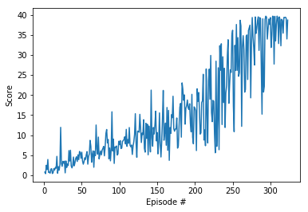

# Project 2 : Reacher Project (Continuous Control)

## Project's goal

In this environment, a double-jointed arm can move to target locations. A reward of +0.1 is provided for each step that the agent's hand is in the goal location. Thus, **the goal of the agent is to maintain its position at the target location for as many time steps as possible.**

## Environment details

The environment is based on [Unity ML-agents](https://github.com/Unity-Technologies/ml-agents). The project environment is similar to the [Reacher](https://github.com/Unity-Technologies/ml-agents/blob/master/docs/Learning-Environment-Examples.md#reacher) environment on the Unity ML-Agents GitHub page.

> The Unity Machine Learning Agents Toolkit (ML-Agents) is an open-source Unity plugin that enables games and simulations to serve as environments for training intelligent agents. Agents can be trained using reinforcement learning, imitation learning, neuroevolution, or other machine learning methods through a simple-to-use Python API. 

For this project, can be done with two separate versions of the Unity environment:
- The first version contains a single agent.
- The second version contains 20 identical agents.

**In my implementation I have chosen to solve the First version of the environment (Single Agent) using the off-policy DDPG algorithm.** The task is episodic, and **in order to solve the environment, the agent must get an average score of +30 over 100 consecutive episodes.**


## Agent Implementation

### Deep Deterministic Policy Gradient (DDPG)

This project implements an *off-policy method* called **Deep Deterministic Policy Gradient** and described in the paper [Continuous control with deep reinforcement learning](https://arxiv.org/abs/1509.02971). 

> We adapt the ideas underlying the success of Deep Q-Learning to the continuous action domain. We present an actor-critic, model-free algorithm based on the deterministic policy gradient that can operate over continuous action spaces. Using the same learning algorithm, network architecture and hyper-parameters, our algorithm robustly solves more than 20 simulated physics tasks, including classic problems such as cartpole swing-up, dexterous manipulation, legged locomotion and car driving. Our algorithm is able to find policies whose performance is competitive with those found by a planning algorithm with full access to the dynamics of the domain and its derivatives. We further demonstrate that for many of the tasks the algorithm can learn policies end-to-end: directly from raw pixel inputs.

Deep Deterministic Policy Gradient (DDPG) is an algorithm which concurrently learns a Q-function and a policy. It uses off-policy data and the Bellman equation to learn the Q-function, and uses the Q-function to learn the policy.

More details available on the Open AI's [Spinning Up](https://spinningup.openai.com/en/latest/algorithms/ddpg.html) website.


### Algorithm


This algorithm screenshot is taken from the [DDPG algorithm from the Spinning Up website](https://spinningup.openai.com/en/latest/algorithms/ddpg.html)


### Code implementation

The code used here is derived from the "DDPG bipedal" tutorial from the [Deep Reinforcement Learning Nanodegree](https://www.udacity.com/course/deep-reinforcement-learning-nanodegree--nd893), and has been slightly adjusted for being used with the reacher environment.

The code is written in [Python 3.6](https://www.python.org/downloads/release/python-360/) and is relying on [PyTorch 0.4.0](https://pytorch.org/docs/0.4.0/) framework.

The code consist of :

- `model.py` : Implement the Actor and the Critic classes.
    - The Actor and Critic classes each implements a Target and a Local neural networks used for the training.
    
- `ddpg_agent.py` : Implement the DDPG agent and a Replay Buffer memory used by the DDPG agent.
    - The Actor's Local and Target neural networks, and the Critic's Local and Target neural networks are instanciated by the Agent's constructor
    - The `learn()` method updates the policy and value parameters using given batch of experience tuples.
        
        >Q_targets = r + γ * critic_target(next_state, actor_target(next_state))
        where:
            actor_target(state) -> action
            critic_target(state, action) -> Q-value
  
- `Reacher_Project.ipynb` : This Jupyter notebooks allows to instanciate and train the agent. More details:
  - Prepare the Unity environment and Import the necessary packages 
  - Check the Unity environment
  - Define a helper function to instanciate and train a DDPG agent
  - Train an agent using DDPG (including Hyperparameters evaluation)
  - Plot the score results

### DDPG parameters and results

#### Methodology

As beginning, I used the parameters values described in the paper [Continuous control with deep reinforcement learning](https://arxiv.org/abs/1509.02971). 

But these results were not great with the project's reacher environment. So I tried with other parameters values, such as network size, learning rate, discount factor and etc.. So here are something that I found interesting:

- Firstly, increasing the number of steps per episode has significante influence on the learning. The more the better. Also worth mentioning that this environment seems to finish an episode after 1000 steps.
- The Sigma values used in the Ornstein-Uhlenbeck noise process is another important parameter for learning. Reducing it can improve the learning result.
- Batch normalization can helpe a lot in our case. So I add batch normalization after the activation layers in neural networks.
- As the environment state and action size in our case are rather simple, so using smaller neural networks helps to improved the learning, i.e. less units. 
- Lastly, using smaller the learning rates for both the actor and critic networks.

#### DDPG parameters

The final version of my DDPG agent uses the following parameters values (These parameters are passed in the main training function `ddpg()` defined and called in the notebook.)

```
state_size = 33         # environment State size 
action_size = 4         # environment Action size 
BUFFER_SIZE = int(1e6)  # replay buffer size
BATCH_SIZE = 128        # minibatch size

GAMMA = 0.99                  # discount factor
TAU = 1e-3                    # for soft update of target parameters

LR_ACTOR = 2e-4               # learning rate of the actor 
LR_CRITIC = 2e-4              # learning rate of the critic
WEIGHT_DECAY = 0              # L2 weight decay
actor_fc1_units = 128         # Number of units for the layer 1 in the actor model
actor_fc1_units = 128         # Number of units for the layer 2 in the actor model
critic_fcs1_units = 128       # Number of units for the layer 1 in the critic model
critic_fc2_units = 128        # Number of units for the layer 2 in the critic model

mu = 0.                       # Ornstein-Uhlenbeck noise parameter
theta = 0.15                  # Ornstein-Uhlenbeck noise parameter
sigma = 0.2                   # Ornstein-Uhlenbeck noise parameter
```

The **Actor Neural Networks** use the following architecture :

```
Input nodes (33) 
  -> Fully Connected Layer (128 nodes, Relu activation) 
    -> Batch Normlization
      -> Fully Connected Layer (128 nodes, Relu activation) 
         -> Ouput nodes (4 nodes, tanh activation)
```


The **Critic Neural Networks** use the following architecture :

```
Input nodes (33) 
  -> Fully Connected Layer (128 nodes, Relu activation) 
    -> Batch Normlization
      -> Include Actions at the second fully connected layer
        -> Fully Connected Layer (128+4 nodes, Relu activation) 
          -> Ouput node (1 node, no activation)
```

#### Results

Given the chosen architecture and parameters, our result is as following:



Our algorithm meets the project's expectation as the agent is able to receive an average reward of at least +30 in 323 episodes.


### Ideas for future work

As discussed in the instructions, a further improvement for this project would be to train the 20-agents version. In that case, it might be better to use another algorithm like [PPO](https://arxiv.org/pdf/1707.06347.pdf), [A3C](https://arxiv.org/pdf/1602.01783.pdf), and [D4PG](https://openreview.net/pdf?id=SyZipzbCb). These algorithms use multiple (non-interacting, parallel) copies of the same agent to distribute the task of gathering experience.  

For example, the idea for "Distributed Distributional Deterministic Policy Gradients [D4PG](https://openreview.net/pdf?id=SyZipzbCb)" is as following:

> This work adopts the very successful distributional perspective on reinforcement learning and adapts it to the continuous control setting. We combine this within a distributed framework for off-policy learning in order to develop what we call the Distributed Distributional Deep Deterministic Policy Gradient algorithm, D4PG. We also combine this technique with a number of additional, simple improvements such as the use of N-step returns and prioritized experience replay. Experimentally we examine the contribution of each of these individual components, and show how they interact, as well as their combined contributions. Our results show that across a wide variety of simple control tasks, difficult manipulation tasks, and a set of hard obstacle-based locomotion tasks the D4PG algorithm achieves state of the art performance.

Another enhancement would be to replace the Ornstein-Uhlenbeck noise process with parameter noise as described in Open AI's paper [Parameter Space Noise for Exploration](https://arxiv.org/abs/1706.01905):

> Deep reinforcement learning (RL) methods generally engage in exploratory behavior through noise injection in the action space. An alternative is to add noise directly to the agent's parameters, which can lead to more consistent exploration and a richer set of behaviors. Methods such as evolutionary strategies use parameter perturbations, but discard all temporal structure in the process and require significantly more samples. Combining parameter noise with traditional RL methods allows to combine the best of both worlds. We demonstrate that both off- and on-policy methods benefit from this approach through experimental comparison of DQN, DDPG, and TRPO on high-dimensional discrete action environments as well as continuous control tasks. Our results show that RL with parameter noise learns more efficiently than traditional RL with action space noise and evolutionary strategies individually.

See also :
- Open AI's blog post [Better Exploration with Parameter Noise](https://blog.openai.com/better-exploration-with-parameter-noise/)
- A [project repository](https://github.com/ikostrikov/pytorch-ddpg-naf/blob/master/param_noise.py) that might be helpfull to implement parameter noise in Pytorch (as the Open AI baseline models are currently implemented with Tensorflow)